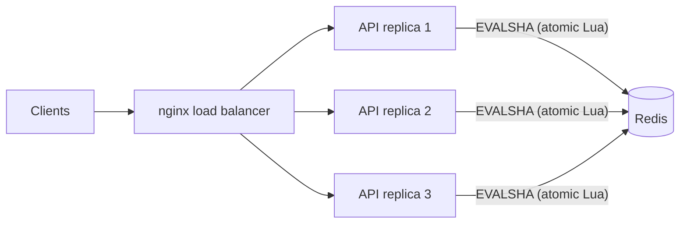

# Distributed Rate Limiter

A Redis-backed rate limiter that lets **many API servers share one limit** without race conditions. It supports two algorithms (token bucket and sliding window), plugs into FastAPI as middleware, and keeps working when Redis goes down.



## Why this is hard

A limiter on one server can keep a counter in memory. Once you run several replicas behind a load balancer, each one only sees part of the traffic, so the counter has to live somewhere shared. The obvious fix (read the count from Redis, check it, write it back) has a **race condition**: two replicas read the same value at the same moment and both let the request through.

`tests/test_concurrency.py` shows this. With a limit of **150** and 8 concurrent clients, the naive read-then-write counter let through **~700 requests** (5 runs: 765, 711, 694, 722, 710). The Lua-script version lets through **exactly 150** every time.

## Design

| Decision | Why |
| --- | --- |
| **Each check is one Lua script** (`ratelimiter/lua/`) | Redis runs a script atomically, so the read, the math and the write can't interleave with another replica. No locks needed. |
| **Time comes from Redis (`TIME`)**, not the app server | All replicas agree on "now", so clock drift between servers can't create extra tokens. |
| **`EVALSHA` via `register_script`** | Only a 40-byte hash is sent per call. If Redis restarts and loses its script cache, the client reloads the script automatically (tested). |
| **Keys expire** once a bucket would be full again | Memory stays bounded even with millions of distinct users. |
| **Fail-open / fail-closed switch** | If Redis is unreachable, choose availability (let traffic through) or protection (reject). Responses get an `X-RateLimit-Degraded` header so it shows up in monitoring. Short socket timeouts (50 ms) keep a Redis outage from stalling the API. |
| **Standard HTTP semantics** | `429 Too Many Requests`, `Retry-After`, `X-RateLimit-Limit`, `X-RateLimit-Remaining`. |

### Algorithms

- **Token bucket** (`TokenBucketLimiter`): allows short bursts up to `capacity`, then a steady `refill_per_sec`. Stores two numbers per key, so it's O(1) memory. Supports weighted requests (`cost`).
- **Sliding window log** (`SlidingWindowLimiter`): at most `limit` requests in *any* rolling window, with no burst at window boundaries. Uses a sorted set per key, so memory grows with the limit.

## Results

Measured on a 2-vCPU Linux VM with Redis 7 running locally. Rerun on your own machine with the commands below.

| Check | Result |
| --- | --- |
| Test suite | 25 pytest tests, including threads and separate processes racing on one key |
| Correctness under concurrency | Exactly 150/150 allowed across 8 concurrent clients (naive counter: ~700) |
| 3 API replicas, 1,000 requests, limit 100 | **100 allowed, 900 rejected**, split 33/34/33 across replicas |
| Decision latency (4 client threads) | token bucket **p50 0.51 ms, p99 1.77 ms**; sliding window p50 0.59 ms, p99 2.06 ms |
| Throughput (one Python process) | ~6,500 decisions/s (bound by the Python client, not Redis) |

## Run it

```bash
pip install -r requirements-dev.txt
redis-server --daemonize yes          # or: docker run -p 6379:6379 redis:7-alpine

pytest -q                             # tests (uses Redis db 15)
python bench/bench_limiter.py         # latency / throughput
```

Three replicas behind nginx:

```bash
docker compose up --build
curl -i http://localhost:8080/api/resource        # through the load balancer
python bench/multi_instance.py --urls http://localhost:8001 http://localhost:8002 http://localhost:8003
```

Use it in your own FastAPI app:

```python
import redis
from fastapi import FastAPI
from ratelimiter import RateLimitMiddleware, TokenBucketLimiter

client = redis.Redis.from_url("redis://localhost:6379/0", socket_timeout=0.05, decode_responses=True)
app = FastAPI()
app.add_middleware(RateLimitMiddleware, limiter=TokenBucketLimiter(client, capacity=20, refill_per_sec=5))
```

Requests are limited per `X-API-Key` header when present, otherwise per client IP. Pass your own `identity` function to limit by user ID, route, or anything else.

## CI

GitHub Actions runs `ruff` and the full test suite against a real Redis service on Python 3.11 and 3.12, then starts the 3-replica Docker Compose stack and fails the build if the shared limit is ever exceeded.

## What I'd add next

- Redis Cluster support (hash tags so a key's data stays on one shard)
- A local in-memory pre-check to cut Redis round trips for clients that are far over their limit
- Prometheus metrics for allowed / rejected / degraded decisions
- Deploy on AWS (ECS + ElastiCache) with Terraform

## Layout

```
ratelimiter/
  lua/token_bucket.lua     atomic token bucket
  lua/sliding_window.lua   atomic sliding-window log
  limiter.py               Python API, fail-open/closed handling
  middleware.py            FastAPI/Starlette middleware (429 + headers)
  app.py                   demo API
tests/                     unit, concurrency, failure-mode, middleware tests
bench/                     latency benchmark + multi-replica check
docker-compose.yml         redis + 3 replicas + nginx
```
